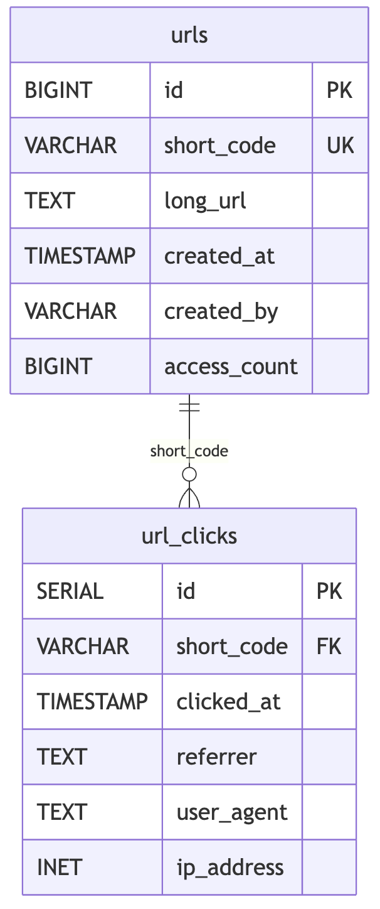
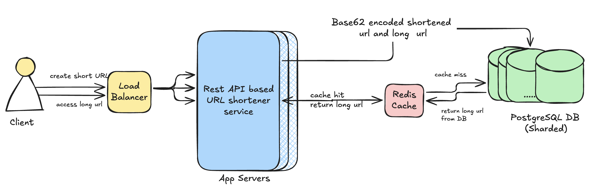

# Problem Statement
Design a system that generates unique short URLs for given long URLs, ensuring efficient storage and quick retrieval. Focus on the encoding algorithm, database design, and how to handle high read-write ratios and potential collisions.
[Website Link here](https://bugfree.ai/practice/system-design/url-shortener)

## Table of Contents
1. [Requirements](#requirements)
   - [Functional Requirements](#functional-requirements)
   - [Non-Functional Requirements](#non-funcitional-requirement)
2. [Assumptions](#assumptions)
3. [API Design](#api-design)
   - [Create a Shortened URL](#create-a-shortened-url)
   - [Retrieve the Long URL](#retrieve-the-long-url)
4. [Database](#database)
5. [Hashing Algorithm](#hashing-algorithm)
6. [Caching Layer](#caching-layer)
7. [Architecture Diagram](#architecture-diagram)
8. [Trade-Offs](#trade-off)

# Requirements
### Functional Requirements
- Create shortest possible URLs for given URL
- Redirectto original URL via short url
- No short url expiry
- Metric collection { _nice to have_ }
### Non Funcitional Requirement
- Up and Running system , at peak hours.

# Assumptions
- Short urls would not expire and would be active for lifetime.
- Assuming **10M** URLs generated per day
    - 10M/24/3600 = ~1160 URL creations per second
    - Assuming Higher traffic , let us consider for 1500 url creations per second
    - Taking read write ratio as 100:1 , 150k url reads per second
- Assuming **100 bytes** per url entry
    - 1500 urls per second for an application that would run for 10 years would typically have ≈ 473 billion URLs
    - ≈ 47.3 TB of raw storage. 
    - Must also consider indexes and cache storage

# API Design
- Going with the industry standard REST API suire

### Create a shortened URL
> **Note**
> - `Idempotency-Key` is optional and prevents duplicate creation during retries.
> - Authentication is optional depending on product requirements.

---

POST : /createUrl
#### Request Body
```json
{
  "long_url": "https://example.com/some/very/long/url",
  "custom_alias": "my-link",
  "expiry": "2026-01-01T00:00:00Z"
}
```
#### Response
status code: 201
``` json
{
  "short_url": "https://sho.rt/abc123",
  "short_code": "abc123",
  "created_at": "2026-01-17T10:00:00Z"
}
```

### Retrieve the long url
 status code: 302
#### Request
``` json
GET /{short_code}
```
#### Response
``` json
GET /{short_code}
```
# Database
- Choosing PostgreSQL for my use case as per below mentioned considerations:
  - Simple key-value entries with some relational needs
  - PostgreSQL has scalability capabilities
  - cost effective as it is open source
- Below is the Table design
**URL**
``` sql 
CREATE TABLE urls (
    id BIGINT PRIMARY KEY,           -- Global ID for Base62
    short_code VARCHAR(10) UNIQUE,      -- Base62 encoded ID
    long_url TEXT NOT NULL,
    created_at TIMESTAMP DEFAULT CURRENT_TIMESTAMP,
    created_by VARCHAR(50),
    access_count BIGINT DEFAULT 0,
  
    UNIQUE INDEX idx_short_code (short_code),  -- Main lookup index
    INDEX idx_created_by (created_by)
);
```

**URL_CLICK**
``` sql
CREATE TABLE url_clicks (
    id SERIAL PRIMARY KEY,
    short_code VARCHAR(10) REFERENCES urls(short_code),
    clicked_at TIMESTAMP DEFAULT CURRENT_TIMESTAMP,
    referrer TEXT,
    user_agent TEXT,
    ip_address INET
);

CREATE INDEX idx_clicks_short_code ON url_clicks(short_code);
CREATE INDEX idx_clicks_date ON url_clicks(clicked_at);
```



**Indexes**:
- urls: idx_created_by(created_by)
- urls: idx_created_at(created_at)
- url_clicks: idx_clicks_short_code(short_code)
- url_clicks: idx_clicks_date(clicked_at)

# Hashing Algorithm
- Given that we want to generate the shortest possible URL, we would consider **Base 62 encoding** technique. While, if we want to weigh security as main aspect, random hash generation with collision handling would be a better choice for production ready systems.
- Base62 encoding does introduce a sharding problem, as we have sequential auto increment Ids. 
```
id: 1000000 → base62: "4c92"  → shard_4 (based on first char)
id: 1000001 → base62: "4c93"  → shard_4 (same shard!)
id: 1000002 → base62: "4c94"  → shard_4 (same shard!)
```

- This is called hot shard problem.
- We can solve this by using the entire short code as hash. Since hash would be generated from unique global Id, it would not collide.

# Caching Layer
We implement Redis as our primary caching layer to optimize URL retrieval performance and reduce database load. This design addresses the high read-to-write ratio (100:1) characteristic of URL shortener systems.

Following are the benefits of using a caching layer:
- **Speed Improvement**: Memory access (~1ms) vs Database access (~5-10ms)
- **Throughput**: Handles 150K reads/second with sub-millisecond latency
- **Database Load Reduction**: Reduces PostgreSQL load by 85-90% through cache hits
- **Scalability**: Horizontal scaling through Redis clustering
# Architecture Diagram

# Trade Off
#### 1. Do we allow creating multiple short URLs for one long url, to maintain idempotency ?
#### 2. Should we have fewer shards and more data in it? or more shards with fewer data in it? What is the optimum number of shards?

#### 3. Which Hashing technique to use 
Comparison Table: Base62 vs MD5 vs Hash+Collision Resolution
|ASPECT| BASE62 (AUTO-INCREMENT)|MD5 HASH|RANDOM HASH + COLLISION RESOLUTION| 
|------|------------------------|--------|----------------------------------|
|URL Length|⭐⭐⭐ 4-7 chars|❌ 32 chars|⭐⭐ 6-8 chars|
|Example Output|abc1, xyz9|5d41402abc4b2a76b9719d911017c592|aB3x9K, mN7pQ2|
|Collision Risk|⭐⭐⭐ Zero|⭐⭐⭐ Near zero|⭐⭐ Low (handled)|
|Implementation Complexity|⭐⭐⭐ Simple|⭐⭐⭐ Simple|⭐ Complex|
|Database Writes|1 write|1 write|1-3 writes avg|
|Security/Privacy|❌ Predictable|⭐⭐⭐ Unpredictable|⭐⭐⭐ Unpredictable|
|Sharding Distribution|❌ Poor (sequential)|⭐⭐⭐ Excellent|⭐⭐⭐ Excellent|
|Scalability|⭐⭐ Good|⭐⭐⭐ Excellent|⭐⭐ Good|
|URL Guessability|❌ Easily guessable|⭐⭐⭐ Not guessable|⭐⭐⭐ Not guessable|
|Storage Efficiency|⭐⭐⭐ 10 bytes|❌ 32 bytes|⭐⭐ 8 bytes